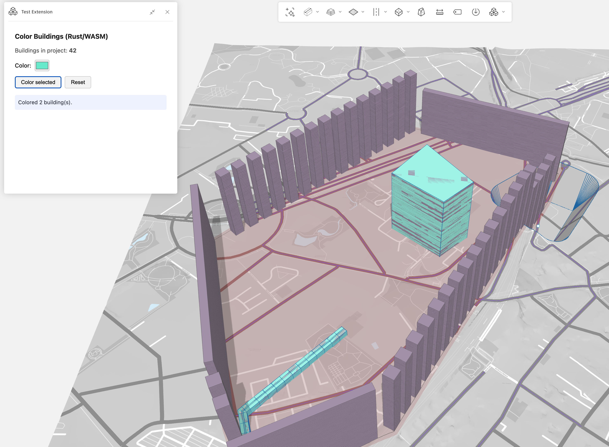

# forma-embedded-view-sdk-bindings-rust

> **DISCLAIMER: This project is NOT officially supported, maintained, or endorsed by Autodesk in any way. These bindings are entirely unofficial and community-driven. Autodesk provides no warranty, guarantee, or support for this code. The official Forma Embedded View SDK is a JavaScript/TypeScript package; these Rust/WASM bindings are a third-party effort that may break at any time without notice as the upstream SDK evolves. Use at your own risk.**

Rust/WASM bindings for the [forma-embedded-view-sdk](https://www.npmjs.com/package/forma-embedded-view-sdk) npm package, plus a sample Autodesk Forma extension written entirely in Rust.

## Workspace structure

```
├── crates/
│   └── forma-embedded-view-sdk/   # Rust bindings crate (wasm-bindgen)
├── examples/
│   └── sample-extension/          # Sample Forma extension in Rust/WASM
│       ├── src/lib.rs             # Extension logic
│       ├── web/index.html         # HTML entry point
│       └── build.sh               # Build script
└── Cargo.toml                     # Workspace root
```

## Quick start

### Prerequisites

- [Rust](https://rustup.rs/) with the `wasm32-unknown-unknown` target:
  ```bash
  rustup target add wasm32-unknown-unknown
  ```
- [wasm-pack](https://rustwasm.github.io/wasm-pack/installer/):
  ```bash
  cargo install wasm-pack
  ```

### Build and serve the sample extension

```bash
# Build the WASM binary
cd examples/sample-extension
./build.sh

# Serve locally
cd web
python3 -m http.server 8080
```

Then configure your Forma extension's embedded view URL to `http://localhost:8080`.

### What the sample extension does

The sample extension is a **Color Selected Buildings** tool:

1. On load it queries all building elements in the current Forma project
2. You select buildings in the 3D scene, pick a color, and click **Color selected**
3. The selected buildings are overlaid with the chosen color via the Render API
4. Click **Reset** to clear all color overlays

This mirrors the [official color-buildings tutorial](https://github.com/spacemakerai/color-buildings-tutorial) but implemented in Rust compiled to WebAssembly.



## Using the bindings in your own project

Add the bindings crate as a dependency:

```toml
[dependencies]
forma-embedded-view-sdk = { path = "path/to/crates/forma-embedded-view-sdk" }
wasm-bindgen = "0.2"
wasm-bindgen-futures = "0.4"
js-sys = "0.3"
```

Use the auto-initialized `Forma` singleton:

```rust
use forma_embedded_view_sdk::FORMA;
use wasm_bindgen_futures::JsFuture;

async fn example() {
    let project_id = FORMA.with(|f| f.get_project_id());

    let promise = FORMA.with(|f| f.project().get());
    let project = JsFuture::from(promise).await.unwrap();
}
```

See [crates/forma-embedded-view-sdk/README.md](crates/forma-embedded-view-sdk/README.md) for full API coverage.
